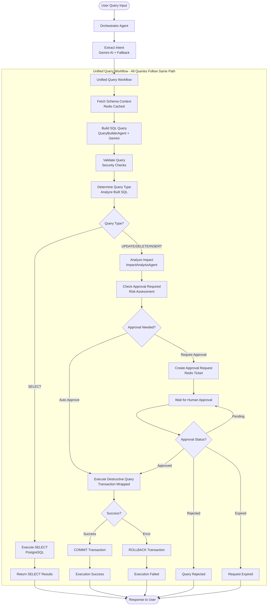
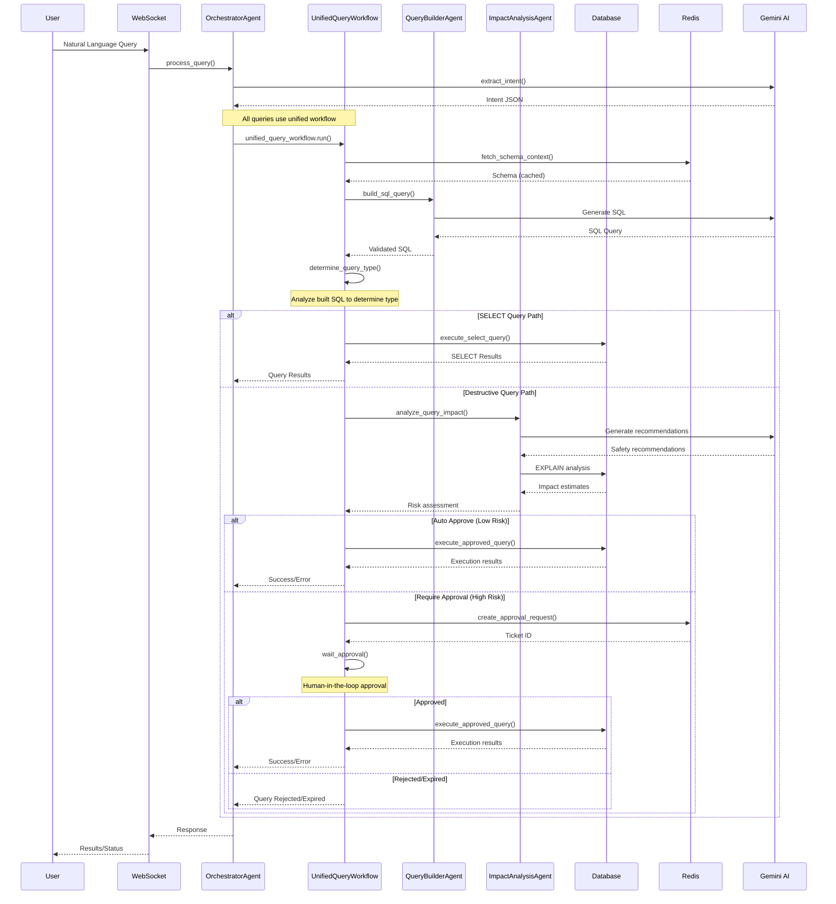

# PostgreSQL AI Agent MVP - System Flow Documentation

This document provides comprehensive flow diagrams for the PostgreSQL AI Agent MVP system, showing the agentic architecture, LangGraph workflows, and data pathways.

## 🏗️ System Architecture Overview--

## 🔄 Complete Query Processing Flow (Unified Workflow)

## 🤖 Agent Interaction Flow (Unified Workflow)

## 🔀 LangGraph State Management (Unified Workflow)

```mermaid
stateDiagram-v2
    [*] --> START
    
    START --> fetch_schema : User Query + Intent
    
    state fetch_schema {
        [*] --> redis_lookup
        redis_lookup --> cache_hit : Found
        redis_lookup --> db_query : Not Found
        db_query --> cache_store
        cache_store --> schema_ready
        cache_hit --> schema_ready
        schema_ready --> [*]
    }
    
    fetch_schema --> build_query
    
    state build_query {
        [*] --> gemini_sql_generation
        gemini_sql_generation --> sql_validation
        sql_validation --> query_optimization
        query_optimization --> [*]
    }
    
    build_query --> validate_query
    
    state validate_query {
        [*] --> syntax_check
        syntax_check --> security_check
        security_check --> complexity_analysis
        complexity_analysis --> [*]
    }
    
    validate_query --> determine_query_type
    
    state determine_query_type {
        [*] --> analyze_sql
        analyze_sql --> classify_operation
        classify_operation --> set_query_type
        set_query_type --> [*]
    }
    
    determine_query_type --> query_type_router : Query Type Determined
    
    query_type_router --> execute_select : SELECT
    query_type_router --> analyze_impact : UPDATE/DELETE/INSERT
    
    state execute_select {
        [*] --> db_connection
        db_connection --> query_execution
        query_execution --> result_formatting
        result_formatting --> [*]
    }
    
    execute_select --> END
    
    state analyze_impact {
        [*] --> heuristic_analysis
        heuristic_analysis --> explain_analysis
        explain_analysis --> risk_classification
        risk_classification --> recommendation_generation
        recommendation_generation --> [*]
    }
    
    analyze_impact --> approval_decision : Impact Complete
    
    state approval_decision {
        [*] --> check_risk_level
        check_risk_level --> auto_approve : LOW/MEDIUM
        check_risk_level --> require_approval : HIGH/CRITICAL
    }
    
    approval_decision --> execute_approved : Auto Approved
    approval_decision --> create_ticket : Approval Required
    
    state create_ticket {
        [*] --> generate_ticket_id
        generate_ticket_id --> store_in_redis
        store_in_redis --> notify_approvers
        notify_approvers --> [*]
    }
    
    create_ticket --> wait_approval
    
    state wait_approval {
        [*] --> check_status
        check_status --> still_pending : PENDING
        check_status --> approved : APPROVED
        check_status --> rejected : REJECTED
        still_pending --> check_status
    }
    
    wait_approval --> execute_approved : Approved
    wait_approval --> END : Rejected
    
    state execute_approved {
        [*] --> verify_approval
        verify_approval --> begin_transaction
        begin_transaction --> execute_query
        execute_query --> commit_success : Success
        execute_query --> rollback_error : Error
        commit_success --> update_ticket_executed
        rollback_error --> update_ticket_failed
        update_ticket_executed --> [*]
        update_ticket_failed --> [*]
    }
    
    execute_approved --> END
    
    END --> [*]
```

## 🗄️ Data Flow Architecture

## 🔐 Security & Approval Flow

## 📊 Performance & Caching Strategy

## 🔧 Error Handling & Recovery

## 🔗 Unified Workflow Architecture Summary

The PostgreSQL AI Agent MVP now uses a **unified query workflow** that processes all queries through the same pipeline, with conditional routing happening AFTER query building rather than at the beginning. This architecture provides several advantages:

### Key Features:
1. **Single Entry Point**: All queries go through `unified_query_workflow.run()`
2. **Late Binding**: Query type determination happens after SQL generation
3. **Consistent Processing**: Same schema fetching, query building, and validation for all queries
4. **Conditional Routing**: Smart routing based on actual SQL analysis, not just intent
5. **Human-in-the-Loop**: Seamless approval workflow for destructive operations

### Workflow Nodes:
- `fetch_schema` → `build_query` → `validate_query` → `determine_query_type`
- **SELECT Path**: `execute_select` → END
- **Destructive Path**: `analyze_impact` → `check_approval_required` → [conditional routing]
  - Auto-approve: `execute_destructive` → END
  - Require approval: `create_approval` → `wait_approval` → [status-based routing]

### State Management:
The `UnifiedQueryState` maintains all necessary data throughout the workflow, including:
- Query building artifacts (SQL, validation, type)
- SELECT execution results
- Destructive query handling (impact analysis, approval tickets, execution results)
- Workflow metadata and error handling

This comprehensive flow documentation provides a complete view of the PostgreSQL AI Agent MVP system architecture, showing how the unified workflow processes all queries through consistent pathways with appropriate safety mechanisms.