# PostgreSQL AI Agent - Enhanced Supervisor Architecture (KISS Approach)

## 🏗️ System Architecture Overview

```mermaid
flowchart TD
    subgraph "Client Layer"
        WS["WebSocket Client"]
        API["REST API Client"]
    end

    subgraph "FastAPI Server"
        WSE["WebSocket /ws/query"]
        APPROVE["/approve/{ticket_id}"]
        REJECT["/reject/{ticket_id}"]
    end

    subgraph "Supervisor OrchestratorAgent (Central Control)"
        SUPERVISOR["🧠 Supervisor Agent<br/>- Internal LangGraph<br/>- Retry Logic<br/>- Intent Validation<br/>- Error Recovery"]
    end

    subgraph "Tool Layer (No Longer Autonomous)"
        QB["🔧 QueryBuilder Tool<br/>(was Agent)"]
        IA["🔧 ImpactAnalysis Tool<br/>(was Agent)"]
        DB_OPS["🔧 Database Tools"]
        CACHE["🔧 Redis Tools"]
    end

    subgraph "External Services"
        GEMINI["Gemini AI"]
        PG["PostgreSQL"]
        REDIS["Redis Cache"]
    end

    WS --> WSE
    API --> APPROVE
    API --> REJECT
    
    WSE --> SUPERVISOR
    APPROVE --> SUPERVISOR
    REJECT --> SUPERVISOR
    
    SUPERVISOR --> QB
    SUPERVISOR --> IA
    SUPERVISOR --> DB_OPS
    SUPERVISOR --> CACHE
    
    QB --> GEMINI
    IA --> GEMINI
    DB_OPS --> PG
    CACHE --> REDIS
```



## 🧠 Supervisor Agent Internal Flow (KISS Approach)

```mermaid
flowchart TD
    START([User Query]) --> SUPERVISOR{🧠 Supervisor OrchestratorAgent}
    
    subgraph "Supervisor's Internal LangGraph (Simple State Machine)"
        SUPERVISOR --> EXTRACT[Node: extract_intent<br/>📝 Parse user query]
        
        EXTRACT --> RETRY_LOOP{🔄 Query Builder Loop<br/>Max 2 attempts}
        
        RETRY_LOOP --> BUILD[Node: build_query<br/>🛠️ Generate SQL]
        BUILD --> VALIDATE[Node: validate_query<br/>✅ Check syntax & safety]
        VALIDATE --> INTENT_CHECK[Node: intent_cross_check<br/>🎯 Does SQL match intent?]
        
        INTENT_CHECK --> SUCCESS_CHECK{All Checks Pass?}
        
        SUCCESS_CHECK -->|❌ SQL Error| FEEDBACK1[Create SQL Feedback]
        SUCCESS_CHECK -->|❌ Intent Mismatch| FEEDBACK2[Create Intent Feedback]
        SUCCESS_CHECK -->|❌ Validation Failed| FEEDBACK3[Create Validation Feedback]
        
        FEEDBACK1 --> RETRY_CHECK1{Attempts < 2?}
        FEEDBACK2 --> RETRY_CHECK2{Attempts < 2?}
        FEEDBACK3 --> RETRY_CHECK3{Attempts < 2?}
        
        RETRY_CHECK1 -->|Yes| BUILD
        RETRY_CHECK2 -->|Yes| BUILD
        RETRY_CHECK3 -->|Yes| BUILD
        
        RETRY_CHECK1 -->|No| ASK_USER[Ask User for Help]
        RETRY_CHECK2 -->|No| ASK_USER
        RETRY_CHECK3 -->|No| ASK_USER
        
        SUCCESS_CHECK -->|✅ All Good| ROUTE{Query Type?}
        
        ROUTE -->|SELECT| EXECUTE_SELECT[Node: execute_select<br/>🔍 Direct execution]
        ROUTE -->|DESTRUCTIVE| ANALYZE[Node: analyze_impact<br/>⚠️ Risk assessment]
        
        ANALYZE --> APPROVAL{Risk Level?}
        APPROVAL -->|LOW/MEDIUM| EXECUTE_DEST[Node: execute_destructive<br/>💥 Safe execution]
        APPROVAL -->|HIGH/CRITICAL| WAIT_APPROVAL[Node: wait_approval<br/>👤 Human approval]
        
        WAIT_APPROVAL --> APPROVED{Status?}
        APPROVED -->|✅ Approved| EXECUTE_DEST
        APPROVED -->|❌ Rejected| REJECTED[Query Rejected]
        APPROVED -->|⏱️ Timeout| EXPIRED[Request Expired]
        
        EXECUTE_SELECT --> SUCCESS[✅ Return Results]
        EXECUTE_DEST --> SUCCESS
        ASK_USER --> CLARIFICATION[💬 Request Clarification]
        REJECTED --> FINAL_RESULT[📤 Final Response]
        EXPIRED --> FINAL_RESULT
        SUCCESS --> FINAL_RESULT
        CLARIFICATION --> FINAL_RESULT
    end
    
    FINAL_RESULT --> END([Response to User])
    
    classDef supervisor fill:#d4edda,stroke:#155724,stroke-width:3px
    classDef node fill:#e3f2fd,stroke:#0d47a1
    classDef decision fill:#fff3cd,stroke:#856404,stroke-width:2px
    classDef success fill:#d1ecf1,stroke:#0c5460
    classDef error fill:#f8d7da,stroke:#721c24
    classDef feedback fill:#fce4ec,stroke:#ad1457
    
    class SUPERVISOR supervisor
    class EXTRACT,BUILD,VALIDATE,INTENT_CHECK,EXECUTE_SELECT,ANALYZE,EXECUTE_DEST,WAIT_APPROVAL node
    class RETRY_LOOP,SUCCESS_CHECK,ROUTE,APPROVAL,APPROVED,RETRY_CHECK1,RETRY_CHECK2,RETRY_CHECK3 decision
    class SUCCESS,FINAL_RESULT success
    class ASK_USER,REJECTED,EXPIRED error
    class FEEDBACK1,FEEDBACK2,FEEDBACK3 feedback
```



## 🔄 Simple Retry Logic (KISS Implementation)

```mermaid
flowchart LR
    subgraph "Query Builder Loop (Max 2 Attempts)"
        A[Attempt 1:<br/>Build SQL] --> B{Success?}
        B -->|✅ Yes| SUCCESS[Continue to<br/>Validation]
        B -->|❌ No| C[Create Feedback:<br/>"SQL had syntax error"]
        C --> D[Attempt 2:<br/>Build SQL with<br/>Feedback]
        D --> E{Success?}
        E -->|✅ Yes| SUCCESS
        E -->|❌ No| FAIL[Ask User:<br/>"I'm having trouble with<br/>this query. Can you<br/>clarify what you want?"]
    end
    
    classDef success fill:#d1ecf1,stroke:#0c5460
    classDef fail fill:#f8d7da,stroke:#721c24
    classDef process fill:#e3f2fd,stroke:#0d47a1
    
    class SUCCESS success
    class FAIL fail
    class A,C,D process
```

## 🎯 Intent Cross-Check Process

```mermaid
flowchart TD
    A[User Intent:<br/>"Delete old records"] --> B[Generated SQL:<br/>"SELECT * FROM records"]
    B --> C{Intent vs SQL Match?}
    
    C -->|❌ Mismatch| D[Feedback:<br/>"User wanted DELETE<br/>but you generated SELECT.<br/>Please fix."]
    C -->|✅ Match| E[Continue to<br/>Execution]
    
    D --> F[Retry SQL Generation<br/>with Feedback]
    F --> G[New SQL:<br/>"DELETE FROM records<br/>WHERE created < '2023-01-01'"]
    G --> H{Intent vs SQL Match?}
    H -->|✅ Match| E
    H -->|❌ Still Wrong| I[Ask User for<br/>Clarification]
    
    classDef success fill:#d1ecf1,stroke:#0c5460
    classDef error fill:#f8d7da,stroke:#721c24
    classDef process fill:#e3f2fd,stroke:#0d47a1
    
    class E success
    class D,I error
    class A,B,F,G process
```

## 🛠️ Key KISS Principles Applied

### 1. **Simple State Management**
```python
class QueryState:
    original_intent: str
    attempts: int = 0
    feedback: str = ""
    sql_query: str = ""
    status: str = "pending"
```

### 2. **3 Core Error Types Only**
- **SQL Syntax Errors** → Retry with error details
- **Intent Mismatch** → Retry with intent clarification
- **Validation Failures** → Ask user for help

### 3. **Linear Retry Logic**
- Max 2 attempts per operation
- Clear feedback between attempts
- Graceful fallback to user clarification

### 4. **Centralized Control**
- Single Supervisor manages entire flow
- Other agents become simple tools
- No delegation - supervisor retains control

